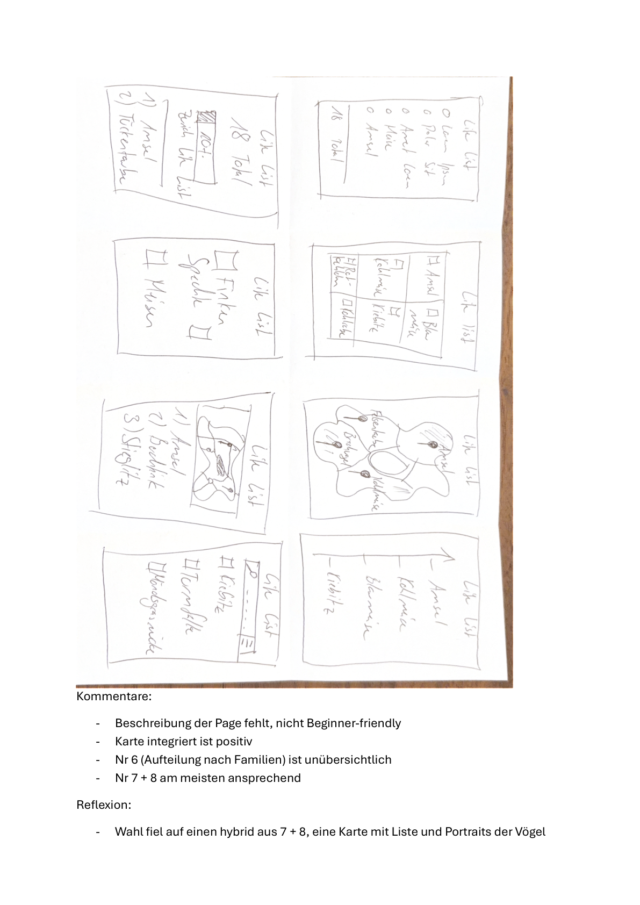
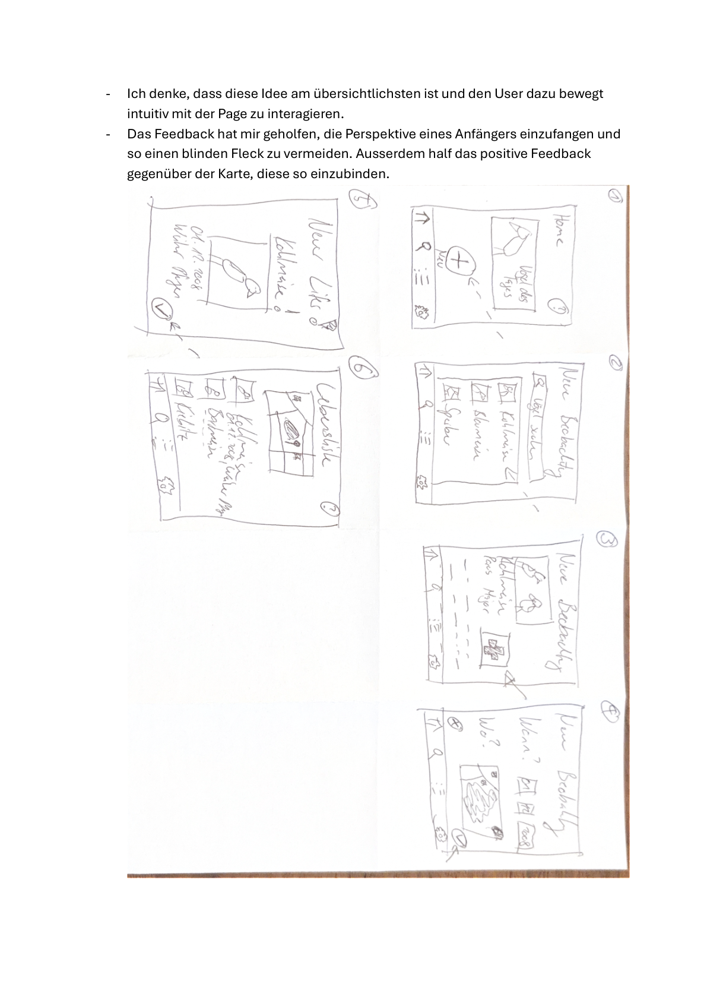
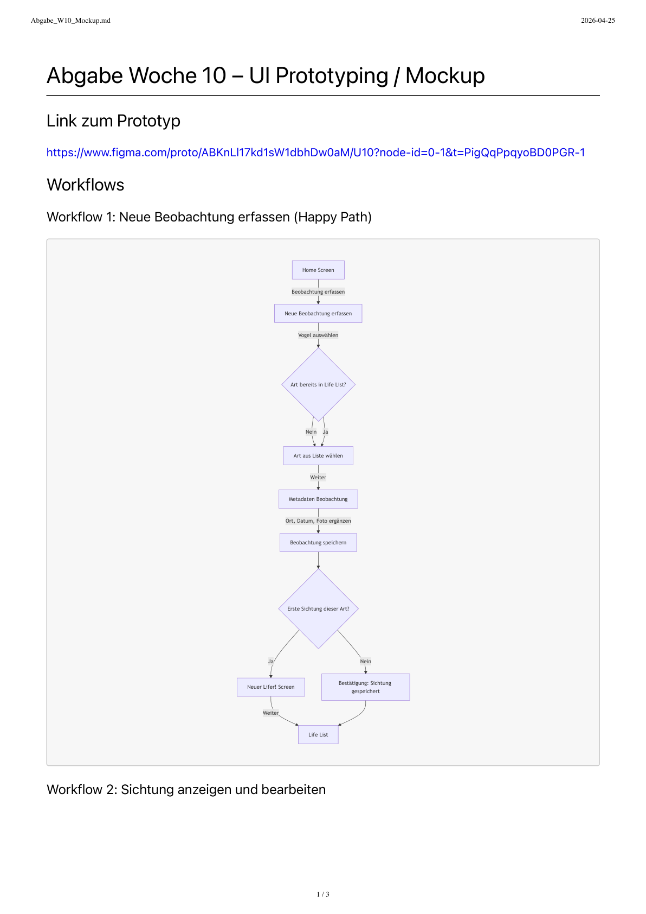
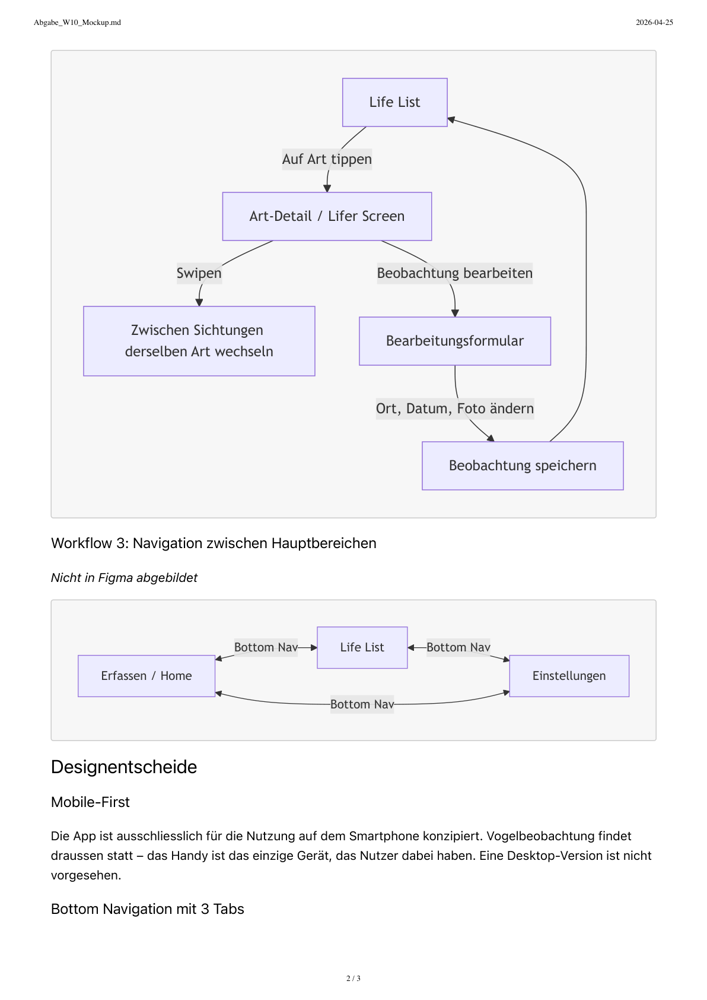
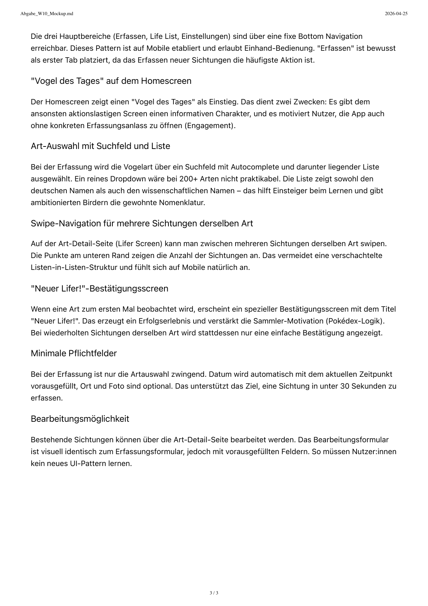

# Projektdokumentation - Lifelist

## Inhaltsverzeichnis

1. [Ausgangslage](#1-ausgangslage)
2. [Lösungsidee](#2-lösungsidee)
3. [Vorgehen & Artefakte](#3-vorgehen--artefakte)
    1. [Understand & Define](#31-understand--define)
    2. [Sketch](#32-sketch)
    3. [Decide](#33-decide)
    4. [Prototype](#34-prototype)
    5. [Validate](#35-validate)
4. [Erweiterungen [Optional]](#4-erweiterungen-optional)
5. [Projektorganisation [Optional]](#5-projektorganisation-optional)
6. [KI-Deklaration](#6-ki-deklaration)
7. [Anhang [Optional]](#7-anhang-optional)

> **Hinweis:** Massgeblich sind die im **Unterricht** und auf **Moodle** kommunizierten Anforderungen.

<!-- WICHTIG: DIE KAPITELSTRUKTUR DARF NICHT VERÄNDERT WERDEN! -->

<!-- Diese Vorlage ist für eine README.md im Repository gedacht. Abschnitte mit [Optional] können weggelassen werden, wenn in den Übungen nichts anderes verlangt wird. -->

## 1. Ausgangslage

Vogelbeobachtung ("Birding") ist ein wachsendes Freizeit-Hobby, das Menschen in die Natur bringt, Achtsamkeit fördert und gleichzeitig wertvolle Daten für den Artenschutz liefern kann. Viele Hobby-Beobachter:innen möchten ihre Sichtungen festhalten – sei es aus persönlichem Interesse (eigene Erfolge sehen, Lernfortschritt verfolgen) oder um zu Citizen-Science-Projekten beizutragen. Bestehende digitale Lösungen sind jedoch entweder zu komplex (Profi-Tools wie eBird oder ornitho.ch mit wissenschaftlichem Anspruch) oder zu rudimentär (Notiz-App, Excel-Liste, Notizbuch).

- **Problem:** Hobby-Vogelbeobachter:innen fehlt ein einfaches, mobiles Werkzeug, um Sichtungen unterwegs schnell festzuhalten und ihre persönlichen Beobachtungserfolge ("Life List") motivierend sichtbar zu machen. Profi-Plattformen schrecken durch Komplexität und wissenschaftliche Pflichtfelder ab; private Notizen sind nicht durchsuchbar und gehen verloren. Beispiel: Wer auf einem Spaziergang spontan einen Eisvogel sieht, möchte das in Sekunden festhalten – nicht erst Distanz, Beobachtungsdauer und Protokolltyp eintragen.

- **Ziele:**
  - Sichtungen in unter 30 Sekunden mobil erfassen können
  - Persönliche Life List automatisch aus Sichtungen ableiten und motivierend visualisieren
  - Niedrige Einstiegshürde für Einsteiger:innen, ohne Funktionsumfang für Fortgeschrittene zu opfern
  - Optionaler Citizen-Science-Mehrwert (Sichtungen als wissenschaftlich verwertbar markieren)

- **Primäre Zielgruppe:** Hobby-Vogelbeobachter:innen vom Einsteiger bis zur fortgeschrittenen Hobbyebene, die ihre Sichtungen persönlich dokumentieren und ihre Lernfortschritte verfolgen möchten – ohne wissenschaftlichen Protokollzwang.

- **Weitere Stakeholder:** Naturpädagog:innen und Lehrpersonen, die mit Gruppen Beobachtungen sammeln; Citizen-Science-Plattformen (z.B. ornitho.ch, eBird) als potenzielle Empfänger freigegebener Sichtungen.

## 2. Lösungsidee

Lifelist füllt die Lücke zwischen "Notizbuch" und "eBird": eine **persönliche Birding-Journal-App mit Life-List-Funktion**, die Spass macht und unterwegs in Sekunden funktioniert – ohne wissenschaftlichen Anspruch an die Nutzer, aber mit optionalem wissenschaftlichem Mehrwert.

- **Kernfunktionalität:**
  - **Workflow 1 – Neue Beobachtung erfassen:** Art aus vorbereiteter Liste wählen, Ort/Datum/Foto ergänzen, speichern. Bei erster Sichtung einer Art erscheint ein "Neuer Lifer!"-Screen.
  - **Workflow 2 – Sichtung anzeigen & bearbeiten:** Life List → Art-Detail-Screen → Sichtung bearbeiten oder zwischen mehreren Sichtungen swipen.
  - **Workflow 3 – Navigation:** Drei Hauptbereiche (Erfassen/Home, Life List, Einstellungen) über fixe Bottom Navigation erreichbar.

- **Annahmen:**
  - Nutzer:innen akzeptieren eine vorbefüllte Artenliste (559 Schweizer Arten aus eBird) statt freier Texteingabe.
  - Die drei Pflichtfelder (Art, Datum, Ort) ermöglichen Erfassung in unter 30 Sekunden.
  - Die "Neuer Lifer!"-Mechanik (Pokédex-Logik) erhöht die Nutzungsmotivation nachweislich.

- **Abgrenzung:**
  - Keine Echtzeit-Artbestimmung via Foto oder Ton (kein Merlin-Klon).
  - Kein automatischer Export zu Citizen-Science-Plattformen (eBird, ornitho.ch) im Mindestumfang.
  - Keine Mehrbenutzer-/Gruppenerfassung (Persona 3 nicht im Scope des Prototyps).

## 3. Vorgehen & Artefakte
Die Durchführung erfolgt phasenbasiert; dokumentieren Sie die wichtigsten Ergebnisse je Phase.

### 3.1 Understand & Define

- **Zielgruppenverständnis:**

  **Problemraumanalyse (Recherche zum Ist-Zustand)**

  | Aspekt | Erkenntnisse |
  |---|---|
  | **Benutzer:innen** | Hobby-Vogelbeobachter:innen vom Einsteiger bis Fortgeschrittenen-Niveau; teilweise mit Bezug zu Citizen Science, mehrheitlich aber rein privat motiviert |
  | **Aufgaben** | Sichtung erfassen (Art, Ort, Zeit, ggf. Notiz/Anzahl); persönliche Life List pflegen; Sichtungen wiederfinden und zurückblicken |
  | **System (Ist)** | eBird, Merlin, ornitho.ch / NaturaList, Notizbuch, Handy-Notizen-App, Excel |
  | **Umfeld** | Outdoor-Nutzung (Wald, Park, Wanderung), oft spontan; teils kalte/feuchte Bedingungen; Smartphone als Hauptgerät; nicht immer stabile Internetverbindung |
  | **Positives (Keep)** | eBird liefert riesige Artendatenbank und globale Reichweite; Merlin's Bestimmungsfunktion ist sehr stark; Life List motiviert nachweislich |
  | **Frustpunkte** | Profi-Tools wirken überladen; lange Erfassungsformulare; analoge Notizen sind nicht durchsuchbar; keine Auswertung möglich; modernes UI fehlt oft |

  **Proto-Personas**
  -
<table>
<tr>
<td width="280">

</td>
<td>

> *"Als Gelegenheits-Beobachterin möchte ich meine Life List auf einen Blick sehen, damit ich meinen Lernfortschritt als Erfolgserlebnis wahrnehme."*

</td>
</tr>
</table>

  
  *Persona 1: Lena, die Gelegenheits-Beobachterin*
  - **Persönliche Attribute:** 28 Jahre, Marketing-Mitarbeiterin, geht regelmässig wandern und spazieren, interessiert sich seit ca. einem Jahr für Vögel
  - **Umfeld:** Smartphone-Nutzung unterwegs, oft im Park oder auf Wochenend-Wanderungen
  - **Ziele:** Wissen, welche Arten sie schon gesehen hat; Lernfortschritt sehen; Hobby spielerisch ausbauen
  - **Aufgaben:** Sichtung schnell festhalten; Life List anschauen; ab und zu durch alte Sichtungen scrollen
  - **Frustpunkte:** eBird wirkt für sie wie ein wissenschaftliches Tool; Notizen-App im Handy ist unstrukturiert; unsicher bei Bestimmung
---

 <table>
<tr>
<td width="280">

</td>
<td>

> *"Als ambitionierter Hobby-Birder möchte ich eine Sichtung nachträglich bearbeiten oder löschen können, damit ich Fehleinträge korrigieren kann."*

</td>
</tr>
</table>

  *Persona 2: Markus, der ambitionierte Hobby-Birder*
  - **Persönliche Attribute:** 52 Jahre, Lehrer, beobachtet seit 15 Jahren, kennt die meisten Schweizer Brutvögel sicher
  - **Umfeld:** Plant gezielte Beobachtungs-Touren; nutzt Fernglas und Bestimmungsbücher; offen für digitale Tools
  - **Ziele:** Persönliches Sichtungs-Archiv über Jahre pflegen; gelegentlich auch wissenschaftlich verwertbare Daten beisteuern
  - **Aufgaben:** Sichtungen detailliert erfassen (Anzahl, Verhalten, Ort); eigene Statistiken anschauen; Sichtungen exportieren
  - **Frustpunkte:** ornitho.ch-Bedienung ist unübersichtlich; will nicht für jede Notiz wissenschaftlich-formal protokollieren
---
 
 <table>
<tr>
<td width="280">

</td>
<td>

> *"Als Naturpädagogin möchte ich mit meiner Klasse gemeinsam Sichtungen erfassen können, damit wir die Beobachtungen später im Unterricht besprechen können."*

</td>
</tr>
</table>

  *Persona 3: Sarah, die Naturpädagogin*
  - **Persönliche Attribute:** 41 Jahre, Primarlehrerin mit Zusatzausbildung Naturpädagogik
  - **Umfeld:** Schulausflüge, Klassen mit 15–20 Kindern, draussen
  - **Ziele:** Beobachtungen mit der Klasse gemeinsam dokumentieren und später im Unterricht reflektieren
  - **Aufgaben:** Schnell und einfach mit Kindern Sichtungen festhalten
  - **Frustpunkte:** Vorhandene Apps sind für Kinder zu komplex

- **Wesentliche Erkenntnisse:**
  - Es gibt eine klare Lücke zwischen "Notizbuch" (zu unstrukturiert) und "eBird/ornitho" (zu komplex)
  - Die Nutzung erfolgt überwiegend mobil und unterwegs – Mobile-First und schnelle Erfassung sind kritisch
  - Die **Life List** ist ein zentrales Motivations-Element und sollte prominent platziert werden
  - Citizen-Science-Beitrag ist für einen Teil der Zielgruppe relevant, aber niemals Pflicht – **Opt-In** ist der richtige Weg
  - Bestimmungs-Unsicherheit ist real – die App muss damit umgehen können (z.B. "unsichere Sichtung" markieren), darf den Workflow aber nicht verlangsamen
  - Persona 3 (Naturpädagogik) bestätigt den Bedarf nach Einfachheit, ist aber kein primärer Designtreiber – wird im Mindestumfang nicht aktiv adressiert
  - Annahmen, die in der Validate-Phase überprüft werden müssen: Akzeptiert die Zielgruppe eine vorbefüllte Artenliste? Reichen die Pflichtfelder (Art, Datum, Ort) für unter 30 Sek. Erfassung?

### 3.2 Sketch

- **Variantenüberblick:** 8 Varianten der Life-List-Seite wurden skizziert, davon eine mit integrierter Karte, eine mit Aufteilung nach Vogelfamilien, und zwei mit Portrait-Karten-Ansicht (Nr. 7 & 8).

- **Skizzen:**

  
  *Seite 1: 8 Varianten der Life-List-Seite. Nr. 1–2: einfache Listen mit Zählern; Nr. 3–4: Kategorie-Checkboxen; Nr. 5: Karten-Ansicht; Nr. 6: Aufteilung nach Familien; Nr. 7–8: Portrait-Karten mit Liste.*

  
  *Seite 2: Detailskizzen des gewählten Hybrid-Konzepts (Nr. 7 + 8) mit Übersichtsseite, Erfassungsflow (Schritte 1–4) und Art-Detail-Screen.*

- **Feedback & Reflexion:**
  - Beschreibung der Page fehlte in frühen Varianten – nicht Beginner-friendly.
  - Integrierte Karte wurde positiv bewertet.
  - Nr. 6 (Aufteilung nach Familien) als unübersichtlich eingestuft.
  - Nr. 7 + 8 als am ansprechendsten bewertet.
  - Entscheid: **Hybrid aus Nr. 7 + 8** – Karte mit Liste und Vogel-Portraits. Das Feedback half, die Perspektive von Einsteiger:innen einzufangen und einen blinden Fleck zu vermeiden.

### 3.3 Decide

- **Gewählte Variante & Begründung:** Hybrid aus Sketch-Varianten 7 + 8: Übersichtsseite mit Vogel-Portrait-Karten und integrierter Karte. Entscheidkriterien: intuitive Interaktion, Beginner-freundlichkeit, klare Seitenbeschreibung, positive Nutzung der Karte.

- **End-to-End-Ablauf:**

  
  *Workflow 1 (Happy Path): Home → Neue Beobachtung → Art wählen → Metadaten (Ort, Datum, Foto) → Speichern → "Neuer Lifer!" oder Bestätigung → Life List.*

  
  *Workflow 2: Life List → Art-Detail → Swipen zwischen Sichtungen / Bearbeiten → Formular → Speichern. Workflow 3: Bottom Navigation zwischen Erfassen, Life List und Einstellungen.*

- **Mockup:** [Figma-Prototyp (interaktiv)](https://www.figma.com/proto/ABKnLl17kd1sW1dbhDw0aM/U10?node-id=0-1&t=PigQqPpqyoBD0PGR-1)

### 3.4 Prototype

#### 3.4.1. Entwurf (Design)
Beschreibt die Gestaltung und Interaktion.
> **Hinweis:** Hier wird der **Prototyp** beschrieben, nicht das **Mockup**.

- **Informationsarchitektur:** Drei Hauptbereiche über fixe Bottom Navigation: **Home/Erfassen** (Vogel des Tages + Erfassungs-CTA), **Life List** (Übersicht aller Beobachtungen als Portrait-Karten), **Einstellungen**. Detailseiten (Art-Detail, Erfassungsformular) sind als modale Ebenen über die Navigation erreichbar.

- **User Interface Design:** Mobile-First, 430 px Telefonschale auf Desktop (zentriert auf dunkelgrünem Hintergrund). Primärfarbe Dunkelgrün (`--primary: #1a5c38`), helle Karten, Nunito als Schrift. Bottom Navigation fix auf Mobile, relativ innerhalb der Shell auf Desktop.

- **Designentscheidungen:**

  

  | Entscheid | Begründung |
  |---|---|
  | **Mobile-First** | Vogelbeobachtung findet draussen statt – Smartphone ist das einzige verfügbare Gerät |
  | **Bottom Navigation mit 3 Tabs** | Etabliertes Mobile-Pattern, erlaubt Einhand-Bedienung; "Erfassen" bewusst als erster Tab |
  | **"Vogel des Tages" auf Homescreen** | Informativer Charakter; motiviert App-Öffnung auch ohne Erfassungsanlass |
  | **Art-Auswahl mit Suchfeld + Autocomplete** | 559 Arten – reines Dropdown nicht praktikabel; zeigt deutschen + wissenschaftlichen Namen |
  | **Swipe-Navigation für Sichtungen derselben Art** | Vermeidet Listen-in-Listen; fühlt sich auf Mobile natürlich an |
  | **"Neuer Lifer!"-Screen** | Erzeugt Erfolgserlebnis bei Ertstsichtung (Pokédex-Logik / Sammler-Motivation) |
  | **Minimale Pflichtfelder** | Nur Artauswahl zwingend; Datum wird vorausgefüllt; Ort/Foto optional → unter 30 Sek. |
  | **Bearbeitungsformular = Erfassungsformular** | Kein neues UI-Pattern zu lernen; vorausgefüllte Felder statt leeres Formular |

#### 3.4.2. Umsetzung (Technik)
Fasst die technische Realisierung zusammen.
- **Technologie-Stack:** _[SvelteKit, Bibliotheken falls genutzt]_
- **Tooling:** _[IDE/Erweiterungen, lokale/Cloud-Tools; den Einsatz von KI beschreiben Sie im Kapitel **KI-Deklaration**]_  
- **Struktur & Komponenten:** _[Seiten, Routen, State/Stores, wichtige Komponenten]_
- **Daten & Schnittstellen:** _[Wie werden Daten gespeichert, verwaltet, abgerufen?]_
- **Deployment:** Die App ist öffentlich erreichbar unter **https://lifelist.tail952aaf.ts.net**

  Die Infrastruktur läuft auf einem selbst gehosteten Proxmox-Server (Heimserver). Darauf betreibt eine Ubuntu-VM einen Docker-Host. Die Anwendung besteht aus zwei Docker-Containern, die via `docker compose` verwaltet werden:

  - **`lifelist-app`** – SvelteKit-App, gebaut mit einem mehrstufigen Dockerfile (Node 22 Alpine, Build-Stage + schlanke Runtime-Stage), lauscht auf Port 3000.
  - **`lifelist-tailscale`** – Tailscale-Sidecar, teilt den Netzwerk-Namespace mit dem App-Container (`network_mode: service:tailscale`). Über Tailscale Funnel wird der App-Port via HTTPS (Port 443, TLS automatisch durch Tailscale) öffentlich zugänglich gemacht. Die MongoDB läuft extern und wird per `MONGODB_URI`-Umgebungsvariable eingebunden.

  ```mermaid
  graph TD
      Browser["Browser / User"]
      Internet["Internet"]
      Funnel["Tailscale Funnel\n(HTTPS :443)"]
      TailscaleC["Container: lifelist-tailscale\nTailscale Sidecar"]
      AppC["Container: lifelist-app\nSvelteKit :3000"]
      MongoDB[("MongoDB\nexternal")]
      DockerHost["Docker Host\nUbuntu VM"]
      Proxmox["Proxmox\nHeim-Server"]

      Browser -->|HTTPS| Internet
      Internet --> Funnel
      Funnel --> TailscaleC
      TailscaleC -->|"Proxy http://127.0.0.1:3000\n(shared network namespace)"| AppC
      AppC -->|MONGODB_URI| MongoDB

      subgraph Proxmox
          subgraph DockerHost
              TailscaleC
              AppC
          end
      end
  ```
- **Besondere Entscheidungen:** _[z. B. Trade-offs, Vereinfachungen]_  

### 3.5 Validate

- **URL der getesteten Version:** https://lifelist.tail952aaf.ts.net

- **Ziele der Prüfung:** Formative, qualitative Usability-Evaluation zur Identifikation von Usability-Problemen während der Entwicklung. Konkrete Fragestellungen:
  1. Finden Nutzer intuitiv den Einstieg, um eine neue Vogelbeobachtung zu erfassen?
  2. Ist die 3-stufige Erfassung (Vogel suchen → Ort/Zeit → Bestätigung) verständlich und effizient?
  3. Verstehen Nutzer den Unterschied zwischen einem neuen "Lifer" und einer Wiederholungssichtung?
  4. Können Nutzer ihre Lifelist durchsuchen und eine gespeicherte Beobachtung aufrufen?
  5. Ist die Karteninteraktion (Marker verschieben / auf Karte tippen) ohne Erklärung verständlich?
  6. Finden Nutzer die Einstellungen (Standardstandort, Statistiken) selbstständig?

- **Vorgehen:** Moderierter Usability-Test, on-site (während KK). Testpersonen erhielten Aufgaben schriftlich auf einem Laptop-Bildschirm, eine nach der anderen, in Alltagssprache ohne UI-Fachbegriffe. Während der Bearbeitung wurden sie gebeten, laut zu denken. Der Testleiter griff so wenig wie möglich ein. Nach jeder Aufgabe kurze Reflexionsfrage; abschliessend ein Post-Test-Interview mit 6 Fragen.

- **Stichprobe:** 2 Testpersonen; Einsteiger-Vogelbeobachter, Smartphone-affin, repräsentativ für potenzielle neue Nutzer. Tests wurden getrennt durchgeführt.

- **Aufgaben/Szenarien:**

  | # | Szenario | Getesteter Bereich |
  |---|----------|--------------------|
  | 0 | Du möchtest die App zum ersten Mal nutzen und brauchst ein Konto. | Login / Registrierung |
  | 1 | Du hast heute morgen beim Spaziergang einen Buchfink beobachtet. Wie hältst du diese Sichtung in der App fest? | Capture-Flow (alle 3 Schritte) |
  | 2 | Du möchtest nachschauen, welche Vögel du bisher gesehen hast, und mehr über eine deiner Sichtungen erfahren. | Lifelist + Detailansicht |
  | 3 | Du stellst fest, dass das Datum deiner letzten Beobachtung nicht stimmt — es war eigentlich gestern. Was machst du? | Beobachtung bearbeiten |
  | 4 | Du möchtest, dass die App beim Erfassen einer Sichtung automatisch deinen Heimatort als Startpunkt vorschlägt. | Einstellungen → Standardstandort |
  | 5 | Du willst einem Freund sagen, wie viele verschiedene Vogelarten du schon in deiner Liste hast. Wo findest du das heraus? | Einstellungen → Übersicht / Stats |

- **Kennzahlen & Beobachtungen:**

  | # | Testperson 1 (Alen) | Testperson 2 (Noel) |
  |---|-------------|---------------------|
  | 0 | Kleiner Stolperer beim Registrierungsflow (mögliches Layer-8-Problem) | Intuitiv, kein Problem |
  | 1 | Intuitive Eingabe; keine Probleme mit Karte oder Zeitangabe | Intuitive Erfassung, keine Probleme |
  | 2 | Erster Klick auf das App-Logo (gleicher Name wie Menüpunkt → Verwirrung) | Intuitiv, keine Probleme |
  | 3 | Datum-Anpassung problemlos | Intuitiv, keine Probleme |
  | 4 | Fragestellung wurde als unklar empfunden; Einstellung selbst wurde intuitiv gefunden → Hinweis: Icon für Standort-Pin auf der Karte fehlt | Intuitiv, keine Probleme |
  | 5 | Doppelte Einträge bei Beobachtung derselben Art aufgefallen | Intuitiv, keine Probleme |

  **Post-Test-Interview (zusammengefasst):**
  - Design als ansprechend und modern bewertet; "Vogel des Tages" und Detailansicht positiv hervorgehoben
  - Erfassungsflow als einfach eingestuft (Skala 1–5: **5 / 5** bei beiden Testpersonen)
  - Übersichtlichkeit der Lifelist: Skala 1–5: **5 / 5**; Wunsch nach Filterfunktion bei grösserer Liste
  - Uhrzeit-Feld wurde nach Datumsbearbeitung als unintuitiv wahrgenommen (Speicherstatus unklar)
  - Gewünschte Zusatzfunktionen: Vogelrufe in der Detailansicht, automatische Vogelerkennung per Foto
  - CSV-Export und Standardstandort-Funktion wurden als sehr nützlich bewertet

- **Zusammenfassung der Resultate:** Beide Testpersonen absolvierten alle Szenarien erfolgreich und bewerteten Erfassung sowie Übersichtlichkeit mit der Höchstnote. Die App ist für Einsteiger intuitiv bedienbar; der Capture-Flow und die Lifelist-Navigation funktionierten ohne Erklärung. Drei Usability-Probleme wurden identifiziert: (1) Logo und Lifelist-Menüpunkt tragen denselben Namen und erzeugen Verwirrung, (2) das Icon für den Standort-Pin auf der Karte fehlt, (3) doppelte Einträge bei mehrfacher Sichtung derselben Art sind unklar kommuniziert.

- **Abgeleitete Verbesserungen** (priorisiert):

  | Priorität | Problem / Wunsch | Begründung |
  |-----------|-----------------|------------|
  | Hoch | Logo von Lifelist-Menüpunkt visuell unterscheiden | Führt zu falschem Klickpfad bei Navigation zur Lifelist |
  | Hoch | Icon für Standort-Pin auf der Karte ergänzen | Fehlende Affordance – Nutzer erkennt die Interaktionsmöglichkeit nicht sofort |
  | Mittel | Doppelte Einträge gleicher Art in der Lifelist zusammenfassen oder klar kennzeichnen | Erzeugt Verwirrung, ob eine Mehrfachsichtung korrekt gespeichert ist |
  | Mittel | Uhrzeit-Feld nach Datumsbearbeitung klar als gespeichert signalisieren | Unsicherheit über Speicherstatus beeinträchtigt Vertrauen |
  | Tief | Filterfunktion für die Lifelist | Relevant erst bei grösserer Datenmenge; positiv erwähnt, aber kein akutes Problem |
  | Tief (Feature) | Vogelrufe in der Detailansicht | Nutzerwunsch; ausserhalb des definierten Scope des Prototyps |

## 4. Erweiterungen [Optional]
Dokumentiert Erweiterungen über den Mindestumfang hinaus.
> **Hinweis:** Jede Erweiterung ist separat nach dem folgenden Schema zu beschreiben.

### _[4.x Kurzbeschreibung / Titel]_  
- **Beschreibung & Nutzen:** _[Was wurde erweitert? Warum?]_  
- **Wo umgesetzt:** _[Wie und wo wurde es gemacht? Frontend, Backend, Datenbank?]_  
- **Referenz:** _[Wo wird die Erweiterung auch noch beschrieben, z.B. Screenshot oder Beschreibung in einem anderen Kapitel]_  
- **Aus Evaluation abgeleitet?:** _[Wurde diese Erweiterung als Folge eines in der Evaluation identifizierten Issues implementiert?]_  

> Das folgende **Beispiel** wurde bewusst kurz gehalten. Erweiterungen dürfen auch ausführlicher beschrieben werden.

### 4.1 Tabelle nach Kategorien filtern
- **Beschreibung & Nutzen:** Tabelle X kann nach Kategorie gefiltert werden, weil User typischerweise nur an einer bestimmten Kategorie interessiert sind.  
- **Wo umgesetzt:** 
  - **Frontend:** Tabelle mit Dropdown in Datei ...
  - **Backend:** Form Action ... in Datei ...
  - **Datenbank:** MongoDB-Query in Datei ...
- **Referenz:** Screenshot in Kap. x.y
- **Aus Evaluation abgeleitet?:** Ja, Issue x.y

## 5. Projektorganisation [Optional]
Beispiele:
- **Repository & Struktur:** _[Link; kurze Strukturübersicht]_  
- **Issue-Management:** _[Vorgehen kurz beschreiben]_  
- **Commit-Praxis:** _[z. B. sprechende Commits]_

## 6. KI-Deklaration
Die folgende Deklaration ist verpflichtend und beschreibt den Einsatz von KI im Projekt.

### 6.1 KI-Tools
- **Eingesetzte Tools**: _[z. B. Copilot, ChatGPT, Claude, lokale Modelle; Version/Variante wenn bekannt]_
- **Zweck & Umfang**: _[wie, wofür und in welchem Ausmass wurde KI eingesetzt (z. B. Textentwürfe, Codevorschläge, Tests, Refactoring); welche Teile stammen (ganz/teilweise) aus KI-Unterstützung?]_
- **Eigene Leistung (Abgrenzung):** _[was ist eigenständig erarbeitet/überarbeitet worden?]_

### 6.2 Prompt-Vorgehen
_[Überlegungen zu Prompt-Vorgehen, Qualität und Urheberrecht/Quellen. Wie wurde beim Prompting vorgegangen? Zu beschreiben ist die grundlegende Vorgehensweise. Einzelne, konkrete Prompts sollten höchstens als Beispiele aufgeführt werden. ]_

### 6.3 Reflexion
_[Nutzen, Grenzen, Risiken/Qualitätssicherung, ...]_

## 7. Anhang [Optional]
Beispiele:
- **Quellen:** _[verwendete Vorlagen/Assets/Modelle; Lizenz/Urheberrecht; ...]_
- **Testskript & Materialien:** _[Link/Datei]_  
- **Rohdaten/Auswertung:** _[Link/Datei]_  

